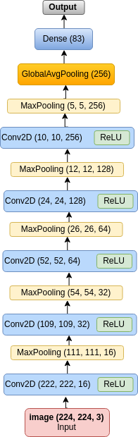
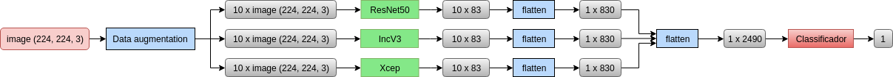

# Predict the dog breed

For more information, read Report.pdf (in Portuguese) or contact me.

## Activities
* Build a Convolutional Neural Network (CNN) from scratch.
* Feature extration with CNN;
* Transfer Learning
* Data augmentation
* Meta Learning

## Build a CNN from scratch

  

Result: 27.13% of accuracy.

## Features extraction with CNN

| Classifier       |   Accuracy    | 
| --------------| -----------------| 
| Nearest Neighbors   |   61.50%     |
| Linear SVM          |   76.53%     |
| RBF SVM             |   69.19%     |
| Decision Tree       |   48.33%     |
| Random Forest       |   81.61%     |
| Neural Network      |   79.75%     |
| Naive Bayes         |   69.86%     |
| Logistic Regression |   78.82%     | 

### Transfer Learning

**Experiment 1 - Fine-tuning**

| Models     | Epochs    |   Accuracy val    | 
| -----------| ----------| --------------| 
| ResNet50    | 75        |   81.45%      | 
| InceptionV3 | 75        |   83.88%     |
| Xception    | 75        |   84.18%     |

**Experiment 2 - Fine-tuning 2**

| Models      | Epochs   |   Accuracy val    | 
| -----------| ----------| --------------| 
| ResNet50     | 3        |   79.49%      | 
| InceptionV3  | 3        |   83.81%     |
| Xception     | 3        |   84.24%     |

**Experiment 3 - Freezing rate**

| Percentage | Epochs | ResNet50 | IncV3       | Xcep       | 
| -----------| ----------| --------------| --------| ------| 
| 90%       | 3      | 79.49%  | 83.81%     | 84.24% |
| 75%       | 3      | 78.49%  | 82.46%     | 84.02% |
| 50%       | 3      | 79.23%  | 82.35%     | 83.41% |
| 25%       | 3      | 79.18%  | 81.47%     | 82.93% | 

**Experiment 4 - Dropout**

| Perc  | Epochs |   Dropout   | ResNet50 | IncV3    | Xcep       | 
| -----------| ----------| --------------| --------| ------| ----- | 
| 25%  | 3      |   0.25      | 78.8%  | 81.8%        | 81.8% |
| 25%  | 3      |   0.50      | 79.5%  | 81.9%        | 82.3% |
| 25%  | 3      |   0.75      | 75.2%  | 77.9%        | 81.0% |
| 25%  | 20     |   0.75      | 81.3%  | 81.5%        | 84.7% |  
| 30%  | 10     |   0.75      | 79.9%  | 82.9%        | 84.0% |  \hline

**Experimento 5 - Optimizers**

rmsprop vs SGD

## Data augmentation 

* RRotation between -40 and +40;
* Shift (height and width) with rate of 20% of size;
* Zoom with rate of 20%;
* Flip horizontal and vertical;
* Shear with intensity 20%.

| Models      | Accuracy train   |   Accuracy val    | 
| ---------| -----------| -----------------| 
| ResNet50     | 71.17%          |   79.19%      | 
| InceptionV3  | 76.91%          |   81.24%     |
| Xception     | 78.08%          |   82.63%     |

## Preliminary results on test dataset 

| Modelos      | Accuracy val     |   Accuracy test    |
| --------| ----------| -------------| 
| ResNet50     | 81.45%          |   85.23%      | 
| InceptionV3  | 83.88%          |   89.47%     |
| Xception     | 84.70%          |   89.55%     |

## Meta Learning

| Classifier       |   Accuracy    |
| ------| --------|  
| Linear SVM          |   91.88%     |
| Random Forest       |   89.57%     |
| Neural Network      |   90.09%     |
| Logistic Regression |   91.42%     | 

## Meta Learning with Data augmentation

  

| Classifier       |   Accuracy    | f1 score| 
| -------| ------| -------| 
| Linear SVM          |   94.48%     | 94.34%|
| Random Forest       |   94.39%     | 94.25%|
| Neural Network      |   96.84%     | 96.55%|
| Logistic Regression |   95.70%     | 95.45%  | 

## Results
The best result: accuracy  97%, e f1-score de 96%. 

| Qty | Accuracy | Qty | Accuracy | 
| ----| ------| ------| ------ | 
| 1 | 11% | 2   | 94%     |
| 1 | 53% | 1   | 95%     |
| 1 | 64% | 4   | 96%     |
| 2 | 88% | 1   | 97%     |
| 1 | 90% | 15  | 98%     |
| 1 | 91% | 6   | 99%     |
| 1 | 92% | 43  | 100%    |
| 3 | 93% |     |         | 
